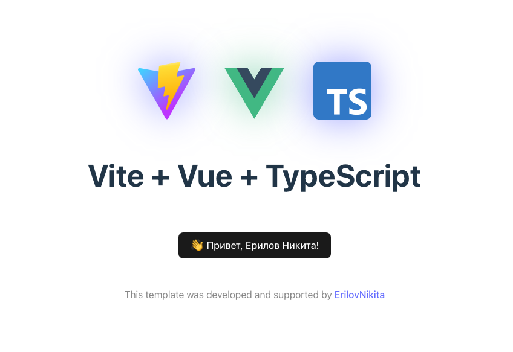

# Create NSMP Embedded App
> Интерактивный генератор embedded-приложений на Vue 3, TypeScript и Vite.

[](https://www.npmjs.com/package/create-nsmp-embedded-app) [](https://www.npmjs.com/package/create-nsmp-embedded-app) [](https://github.com/ErilovNikita/create-nsmp-embedded-app/actions/workflows/npm-publish.yml) [](https://nodejs.org/) [](LICENSE)

```text
    _   _______ __  _______     ______          __             __    __         __   ___  by @minitwiks
   / | / / ___//  |/  / __ \   / ____/___ ___  / /_  ___  ____/ /___/ /__  ____/ /  /   |  ____  ____
  /  |/ /\__ \/ /|_/ / /_/ /  / __/ / __ '__ \/ __ \/ _ \/ __  / __  / _ \/ __  /  / /| | / __ \/ __ \
 / /|  /___/ / /  / / ____/  / /___/ / / / / / /_/ /  __/ /_/ / /_/ /  __/ /_/ /  / ___ |/ /_/ / /_/ /
/_/ |_//____/_/  /_/_/      /_____/_/ /_/ /_/_.___/\___/\__,_/\__,_/\___/\__,_/  /_/  |_/ .___/ .___/
                                                                                       /_/   /_/
```

<!--  -->

Создайте новый NSMP Embedded App одной командой. CLI задаст необходимые вопросы прямо в терминале, скопирует готовый шаблон и при необходимости установит зависимости.

> [!NOTE]
> Данный шаблон использует [собственную ветку](https://github.com/ErilovNikita/js-api) библиотеки `js-api`.

## Возможности
- Интерактивное создание проекта
- Vue 3 + TypeScript + Vite
- Готовая структура для NSMP embedded-приложения
- Проксирование запросов NSMP через Vite
- Сборка приложения и ZIP-архива
- Автоматическая установка npm-зависимостей

## Быстрый старт
Требования: Node.js 18+ и npm.

```bash
npm create nsmp-embedded-app@latest
```

CLI предложит:
1. Имя проекта в формате `lowercase-with-dashes`;
2. Установить ли зависимости автоматически

Также имя можно передать первым аргументом:
```bash
npm create nsmp-embedded-app@latest my-nsmp-app
```

## Настройка окружения
Откройте `.env.development` и замените значения-заглушки на реальные:
Не добавляйте `.env.development` и другие локальные env-файлы в репозиторий.

## Команды шаблона
```bash
npm run dev       # запуск dev-сервера
npm run build     # проверка типов и production-сборка
```

Во время сборки `vite-plugin-zip-pack` создаёт ZIP-архив приложения. Его имя формируется из `VITE_APP_CODE` и версии проекта.

## Испрользование
### Режим разработки
В этом режиме появляется возможность запуска приложения вне сервиса NSMP, для разработки или отладки.

### Настройка
Для корректной работы в этом режиме необходимо создать файл `.env.development` и заполнить данные по примеру из файла `example.env`

### Запуск
```sh
npm run dev
```

### Сборка приложения
До и после сборки нет необходимости что-то менять в коде встроенного приложения, во время сборки, замена всех переменных произойдет автоматически. Так же использование переменных окружения, не допустит попадения критичной информации в сборнный проект.

## Утилиты

| Утилита | Возможности | Документация |
| --- | --- | --- |
| `version` | Получение стабильных релизов GitHub и GitLab, сравнение SemVer, определение обновлений и формирование сообщений о версии | [Смотреть](docs/utils/version.md) |
| `theme` | Получение строкового значения темы через NSMP endpoint | [Смотреть](docs/utils/theme.md) |

## Разработка генератора
Для запуска шаблона из корня этого репозитория:

```bash
npm install
npm --prefix template install
npm run dev
npm run build
```

Чтобы предложить пользователю дополнительную npm-зависимость, добавьте её имя в
массив `optionalDependencies` в `cli/config.js`:

```js
export const optionalDependencies = [
    'nsmp-icons',
    {
        name: '@scope/package',
        version: '1.2.3',
        callback: async ({ targetDir, projectName, packageName, version }) => {
            // Дополнительная настройка созданного проекта.
        }
    }
]
```

Строковая запись добавляет актуальную версию с префиксом `^`. Поле `version`
записывается как есть: можно указать точную версию (`1.2.3`) или npm-диапазон
(`~1.2.3`, `^1.2.3`). Для каждого пакета CLI автоматически создаст отдельный
вопрос и добавит выбранную зависимость в `package.json` нового проекта. Если
указан `callback`, он выполнится только для выбранной зависимости — после
создания проекта, но до запуска `npm install`. Callback может быть асинхронным.

После изменения CLI проверьте его синтаксис:
```bash
npm run check
```

## Лицензия
Проект распространяется под лицензией [MIT](LICENSE).
